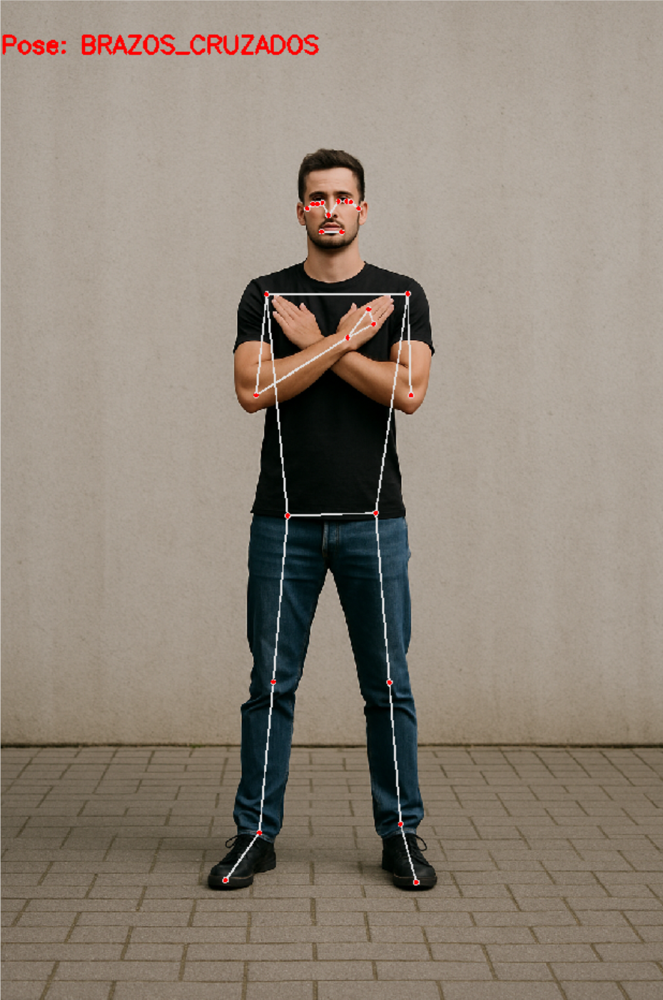

# Resultados de Clasificación de Posturas

Este directorio contiene las salidas gráficas generadas por el modelo de clasificación de poses, utilizando un conjunto de imágenes de prueba.  
Cada imagen muestra:

- La **pose detectada** por el modelo (etiqueta en la esquina superior izquierda).
- El **esqueleto estimado** mediante puntos clave (keypoints) sobre el cuerpo.
- Las **líneas de conexión** entre puntos clave para representar la postura.
- El **fondo original** de la imagen para referencia visual.

---

## Ejemplos de Resultados

### 1. Pose: BRAZOS_CRUZADOS

**Descripción:**  
El sujeto se encuentra de pie, con los brazos cruzados sobre el pecho.  
El modelo identifica los puntos clave de la cabeza, torso, brazos y piernas, conectándolos para mostrar la postura reconocida.

---

### 2. Pose: POSICION_FETAL

**Descripción:**  
El sujeto se encuentra en posición fetal de pie (en cuclillas, con el torso inclinado hacia adelante y brazos recogidos).  
Los puntos clave muestran una postura compacta, con la cabeza inclinada hacia abajo y las rodillas flexionadas.

---

## Uso de estos resultados

Estos resultados se generan como parte del proceso de validación de la red neuronal, para:

1. **Verificar la precisión de la clasificación:**  
   Comparar la etiqueta asignada (`Pose:`) con la postura real del sujeto.
   
2. **Evaluar la detección de puntos clave:**  
   Observar si la red de puntos se ajusta correctamente a la anatomía del sujeto.

3. **Depuración y mejora del modelo:**  
   Detectar posibles errores de clasificación o de estimación de puntos para futuras optimizaciones.

---

## Notas

- Las imágenes son ejemplos representativos y no forman parte del conjunto de entrenamiento.
- El esqueleto está generado mediante un algoritmo de estimación de pose (por ejemplo, [MediaPipe Pose](https://developers.google.com/mediapipe/solutions/vision/pose)).
- La clasificación de la pose está basada en un modelo entrenado con datos etiquetados previamente.

